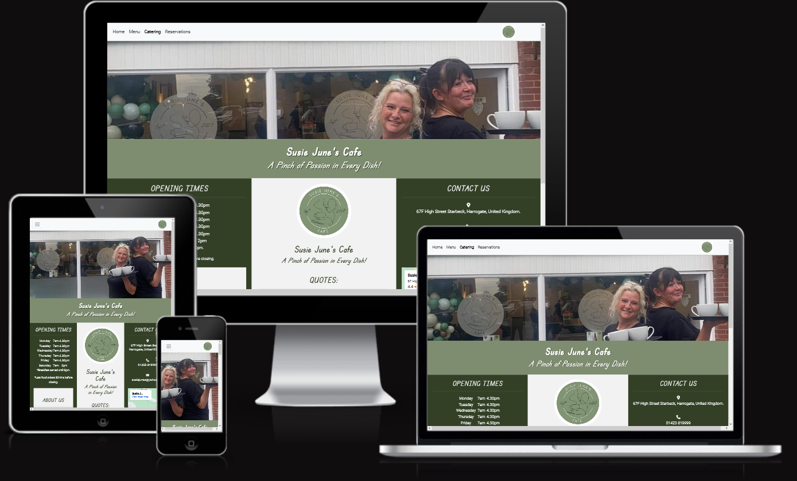

# Susie June's Cafe Website

Welcome to Susie June's Cafe website. Susie June's Cafe is a real cafe, which opened on the High Street in Starbeck in September 2023. The cafe is owned by two ladies, who are best friends with decades of catering experience and no interest in 'technology'. The cafe has a Facebook page run by the daughter of one of the owners, but they have no website, and no other web-presence.

Initially, the only reason the owners wanted a website for the cafe was because they were aware that when people searched the internet for their cafe, poor reviews and damaging photos of the previous establishment came up. They were very keen to wipe away any connection with the previous cafe, and felt that a new website with no mention of the previous establishment, might help to do that. As time went on they became excited about the project and grew to have some very strong opinions about many other things that they wanted from a website.

A live version of the site can be viewed from [here.](https://elizabeth-yorke.github.io/SusieJunes-A/)

Here is a mock-up image of Susie June's Cafe website, using the "Am I Responsive" site.

.

## UX

I began the project by looking through the websites of competing cafes on my phone with my clients. I explained how these website reconfigured for larger screens and I suggested using the 'rule of thirds' where possible as it had been mentioned on my course. I sketched a number of design ideas as we went through this research, and I made a list of the features they were interested in as we went along. I had to explain things like the the burger icon, and that I wanted to add a couple of different pages via a navigation bar.

I explained that I would have to include certain elements (such as the form) for the purpose of my course, and that I could remove anything they didn't really want from the version I will be handing in before they use it. I also had to explain that although I would be making the website for free, they would have to pay hosting fees to a internet host of their choice if they wanted to use it. They looked up the prices of a number of different hosting sites and decided that this would be acceptable.

Looking at competitors websites was not as helpful as it could have been as it turned out there were no directly comparable independent cafe's nearby with websites. We looked at some of the big chain cafes that were nearby (Costa and Cafe Nero), and we looked at some more upmarket independent cafe's in the centre of Harrogate (Betty's, Bean & Bud and Baltharzen's). I really had to work at finding out what it was about one website that they liked more than another. I also talked to them about what they felt their unique selling points were, and what message they wanted to get over to the customer. 

### Wireframes

My wireframes were sketched on paper in front of the clients. There were many versions.
Here are screenshots of the wireframes we finally decided on:

| Page | Phone Wireframe | Tablet Wireframe | Desktop Wireframe |
| --- | --- | --- | --- |
| Home | [phone](assets/wireframes/wireframe-home-phone.jpg) | [tablet](assets/wireframes/wireframe-home-tablet.jpg) | [desktop](assets/wireframes/wireframe-home-desktop.jpg) | 
| Menu | [phone](assets/wireframes/wireframe-menu-phone.jpg) | [tablet](assets/wireframes/wireframe-menu-tablet.jpg) | [desktop](assets/wireframes/wireframe-menu-desktop.jpg) | 
| Catering | [phone](assets/wireframes/wireframe-catering-phone.jpg) | [tablet](assets/wireframes/wireframe-catering-tablet.jpg) | [desktop](assets/wireframes/wireframe-catering-desktop.jpg) | 
| Reservations | [phone](assets/wireframes/wireframe-reservations-phone.jpg) | [tablet](assets/wireframes/wireframe-reservations-tablet.jpg) | [desktop](assets/wireframes/wireframe-reservations-desktop.jpg) | 

The menu page is significantly longer than it looks on the wireframe, but it follows the basic layout. The only significant change to these layouts came when we decided to add quotes from customers. I also figured out how to add a map in so I cam up with a way of including the quotes and balancing the look of the home page. Here are the revised home page wireframes [desktop wireframe](assets/wireframes/wireframe-home-update-desktop.jpg), [tablet wirframe](assets/wireframes/wireframe-home-update-tablet.jpg), [phone wireframe](assets/wireframes/wireframe-home-update-phone.jpg).

### Colour Scheme

In order to keep the website branding as close to the cafe branding as possible, I asked the owners for information on the colours they used in their branding. They didn't have any. So I used Adobe Color [https://color.adobe.com/create/image] to extract the colours from the cafe logo. [image](assets/documentation/adobe-color-wheel.png).

Of the colours identified, I was asked to make as much of the website as I could using the following three colours:
- Off white #F2F2F2
- Dark green #33402A 
- Mid green #7E8C70 

with the following two colours for use if necesary:
- Very dark green #14260C 
- White #FFFFFF 

### Fonts

Initially the clients wanted the exact font on their cafe frontage, but they didn't know what it was, so I used What The Font? [https://www.myfonts.com/pages/whatthefont?step=crop] to identify the font. The font was identifed as being Bernhard Fashion Std Roman. Unfortunately this font cost £40 to use, and the owners didn't want to pay that. So we spent a couple of hours searching Google Fonts in the cafe until they settled on a font that the felt was close enough to the realn font to be acceptable on the website.

They settled on using:
Edu TAS Beginner (for titles and for the slogan)
Roboto (for everything else)
They also said they were quite happy with the font that comes up automatically for 'mundane stuff' as it was 'nicer than the normal font on their menu anyway'.

## User Stories

The user stories I have collected below are authentic user stories, gleaned from interviewing people in the cafe and people walking around nreaby streets.

### New site users

- I want the website to tell me where this cafe is.
- I would like to know what kind of food they serve there.
- I would like to read some reviews from other customers.

### New and returning site users

- I want to be able to check what times and days it is open.
- I want to see evidence in writing that my dog will be allowed inside.
- I want to be able to book a table.

### Returning customers

- I want to reassure my friend that her wheelchair will fit in the cafe.
- I want to find out if they do catering for functions.
- I want links to social media on the website. I don't want to be copying loads of addresses out.

### Cafe Owners

- We want our branding showing really strongly, so people know its not the last place.
- We want photos of our food on the website, not the previous cafe's food.
- We want honest reviews from our customers on there.
- We want more people to know about us so we get more customers.
- We don't want something we have to update or check in on.

## Features

### Existing Features

**Navigation bar with links**
This appears at the top of every page. It has words describing each page in the larger screen sizes and a dropdown menu in the smaller screen sizes.

**Logo links to homepage**
Every logo that you see can be clicked on and will return you to the homepage.

**Social links**
There is a link to the cafe Facebook page in the footer of every page.

**Embedded Map**
You can click on the + or - on the map to zoom in or out, making it easier to identify where the cafe is. If you click on 'view larger map' it will open google maps in a separate browser and you can access all the features Google Maps has to offer that way.

**Menu Downloads**
You can download both sides of the menu you will find on the tables in the cafe. This way you don't even need internet access to make your choice before you arrive.

**Reservation Form**
This form contains validation, so you can only move onto the next bit, it the answer you have already filled in makes sense. Note that only certain answers are required. The owners felt that a telephone numebr was necessary, but that an email address wasn't, as many of their elderly customers don't have emails.

**Audio Menu**
This is a special feature added because the cafe is located close to a specialist college for the visually imapired. Several customers have already trialled it on their phones, and they love it. It saves the owners a lot of time reading all the options out.

**Authentic food pictures and reviews from real customers**
These features were very important to the owners.

**Favicon**
Just a little extra to make the website feel more professional.

**Customised 404 page**
To help customers feel valued even if something goes wrong on the website.

### Future Additions

**Bit Part Audio Menus**
The feedback I have had so far suggests that the cafe customers would like smaller audio menus for each section of the menu so they don't have to listen to the whole thing if they already know what sort of thing they would like.

**Better food pictures, and pictures of the actual people who gave the reviews**
I am still waiting for some photos to be supplied by the client.

**A 'More About Us' page**
Having done some more research and discussed it with the cafe owners, it looks as though adding an extra page with a bit of history or the cafe owners and their philosophy might actually bring more clients to their cafe. The cafe owners would like to make a point of their experience in the industry and advertise the fact that they strive to be a reasonably priced home from home. These facts are a little difficult to place on the website as it is.

**Rotating Hero Image**
The owners were set on the current hero image from the beginning of the project, because they felt their unique selling point was the 'personal touch' they bring to the cafe, so they wanted to be on the hero image. I therefore made sure that the owners can be seen on the image, even in the smallest screen size, choosing to show less of the shop front where necessary. Recently they have decided they would like to have the shop frontage and some of their food featured in the hero image too. I researched how to bootstrap a photo carousel, but I have not yet been supplied with the photos to fill it, so this will have to have to be a future addition now. 

## Testing

Please find details of testing on a separate page [TESTING.md](TESTING.md).

## Technologies Used

- [HTML](https://en.wikipedia.org/wiki/HTML) was used for the main site content.
- [CSS](https://en.wikipedia.org/wiki/CSS)was used for the main site design and layout.
- [Git](https://git-scm.com) was used to commit and push versions of the website as it developed.
- [GitHub](https://github.com) was used for secure online code storage.
- [GitHub Pages](https://pages.github.com)was used to host the deployed front-end site.
- [Bootstrap](https://getbootstrap.com) was used as a framework for modern responsiveness and pre-built components.
- [Google Fonts](https://fonts.google.com/) was used for the fonts.
- [Font Awesome](https://fontawesome.com/) was used for the icons.

- This project was initially started using the IDE [Code Anywhere](https://codeanywhere.com/). Unfortunately there were numerous times when I couldn't access the site, or opening repositories took a long time, or the site crashed unexpectedly. I followed a thread of similar complaints to mine on Slack, and eventually contacted kenan_community_ci who advised me to switch to using [Gitpod](https://gitpod.io). I followed this advice and completed my project using Gitpod as my IDE.
I was a bit worried there might be repercussions to switiching IDEs, as I built my project using the Codeanywhere template, but it seems to be working fine.

## Deployment

The site was deployed to GitHub Pages. The steps to deploy are as follows:
- In the [GitHub repository](https://github.com/Elizabeth-Yorke/SusieJunes-A), navigate to the Settings tab 
- Select Pages from the list on the right.
- Under the Build and Deployment title, click on the 'source' section drop-down menu
- Select **Deploy from a branch**
- Click on the first dropdown menu in the 'branch' section
- Select **Main**
- Click **Save**
- Wait for confirmation that the site has been deployed.

The live link can be found [here](https://elizabeth-yorke.github.io/SusieJunes-A/)

### Local Deployment

This project can be cloned or forked in order to make a local copy on your own system.

### Cloning

You can clone this repository into your preferred IDE in order to edit it at your leisure.
To clone this repository, follow these steps:

1. Go to the [GitHub repository](https://github.com/Elizabeth-Yorke/SusieJunes-A) 
2. Click on the green **Code** button above the files.
3. Select your preferred type of clone (HTTPS, SSH or GitHub CLI).
4. Click on the copy icon to copy the code.
4. Open your chosen IDE.
5. Select New Workspace.
6. Paste the code you have copied (https://github.com/Elizabeth-Yorke/SusieJunes-A.git) into the correct place.
7. Press enter.
8. Wait while the new workspace is created.

### Forking

You can fork this repository in order to create an extra version of it which will be saved into your GitHub account. Once you have done this, you can edit your version and the original version will remain unaffected.

To fork this repository, follow these steps:

1. Log in to GitHub and locate the [GitHub Repository](https://github.com/Elizabeth-Yorke/SusieJunes-A)
2. Locate the "Fork" Button, in the line of grey buttons above the green **Code** button.
3. Click this button.
4. Return to your GitHub Home page. You should now have your own copy of this repository.

### Local VS Deployment

Initially there were some differences between local and live deployment, but since debugging as described in [TESTING.md](TESTING.md) there are now no obvious differences.

## Credits

### Websites Used to Generate Content

Here is a list of websites I used to create this project:

| Source | Location | Notes |
| --- | --- | --- |
| [Code Institute - Whiskey Drop](https://learn.codeinstitute.net/ci_program/level5diplomainwebappdevelopment) | Responsive Layout and Quotes | I used this walkthrough project to help me with a lot of the basic code, code that allowed responsive layout design in particular, and the styling around my quotes section. |
| [Code Institute - Rosie's Resume](https://learn.codeinstitute.net/ci_program/level5diplomainwebappdevelopment) | Header and Footer | I used this walkthrough project to help me with bootstrapping the menu, adding external links and hover colour changes. |
| [Code Institute - Love Running](https://learn.codeinstitute.net/ci_program/level5diplomainwebappdevelopment)| General design | I used the rule of thirds and the central circular image coding from this project. |
| [mdn web docs](https://developer.mozilla.org/en-US/docs/Web/HTML/Element/input) | Reservation Pages | I used this website to help me with the form elements and their labelling and validation. |
| [Stack Overflow](https://stackoverflow.com/questions/) | Anything not strictly in the Code Institute lessons | I looked up questions and answers on Stack Overflow every time I just wanted to see if my ideas were feasible in html and css, before I got carried away researching how to do impossible things. |
| [Favicon.cc](https://www.favicon.cc/) | The Favicon | I used this website to generate my favicon |
| [Dev](https://dev.to/sh20raj/creating-custom-404-pages-on-github-pages-17nb)| The 404 Page | This page just seemed to offer  much easier way of creating the 404 page than everywhere else I looked. |
| [Adobe Color](https://color.adobe.com/create/image)| The brand colors | I used this website to extract the exact brand colours from the logo .|
| [Fontawesome](https://fontawesome.com/) | The icons | I only really used this for the Facebook Icon |
| [Google Fonts](https://fonts.google.com/) | The Fonts | I used this for the fonts all over the website. |
| [Bootstrap](https://getbootstrap.com/docs/5.3/components/navbar/) | Navbar and centralising image placement | I bootstrapped a navbar, and then added the cafe logo and personalised it. I also bootstrapped some image placement code to try to get the menu pictures where I wanted them. Then I played around with it myself until it barely resembled what I originally copied, but it was originally bootstrapped.|

### Photos

The intention was for all photos to be supplied by Susie June's Cafe. Whilst most of the photos are originals from Susie June's Cafe, I will have to hand this project in before I recieve the last few photos. I have therefore used the following images from [Pexels](https://www.pexels.com/) as placeholders so I can hand in the project. These will be replaced with original photos before the cafe uses the site.

| Image Description | Link | Location on Website |
| --- | --- | --- |
| Breakfast Sandwich | [Breakfast Sandwich](https://www.pexels.com/photo/bacon-sandwich-on-plate-139746/) | Menu page, second food photo|
| Cyclist | [Cyclist](https://www.pexels.com/photo/high-angle-view-of-people-on-bicycle-248547/) | Catering page, quotes section |
| Girl Image | [Girl Image](https://www.pexels.com/photo/woman-wearing-red-hat-and-sunglasses-1729931/) | Home page, quotes section |
| Guy Image | [Guy Image](https://www.pexels.com/photo/father-and-son-in-the-park-4586685/) | Home page, Quotes section |
| Omelette | [Omelette](https://www.pexels.com/photo/selective-focus-photography-of-omelette-with-toppings-1437268/) | Menu page, fourth food photo |
| Wedding Couple | [Wedding Couple](https://www.pexels.com/photo/man-in-black-suit-kissing-a-woman-in-white-dress-3785644/) | Catering page, quotes section |

### Other Content

Apart from the photos mentioned above, all website content, including the downloadable menu, and the Facebook page, was supplied by Susie June's Cafe. All grammar, capitalisation, and wording choices on the webiste were also overseen by the owners of the cafe. Including choices such as the use of '&' rather than 'and'. 

## Acknowledgements

- I would like to thank my Code Institute mentor, Sheryl Goldberg for her support throughout the creation and development of this project - her insight and encouragement has been invaluable.
- I would like to thank the [Code Institute](https://codeinstitute.net) tutor team for their assistance with debugging some project issues, and just generally answering my questions.
- I would like to thank the [Code Institute Slack community](https://code-institute-room.slack.com) for the moral support. I found it really helpful to read threads on there.
- I would like to thank my husband Kieron Yorke, for all his help and reassurance, especially when I had trouble with Codeanywhere.
- I would like to thank Peter Wright, who substituted as our cohort tutor just at the point when I happened to have a lot of questions about the README.md content.
- I would like to thank Delyth Jennings, who I have only met on Slack, but who has been really helpful answering numerous silly little questions so I didn't have to bother any tutors.
- I would also like to thank the owners of Susie June's Cafe, for allowing me to build their cafe website even though I had no prior experience.

