# Testing

Resturn back to the [README.md] (README.md) file.

## Validating Code

### HTML

The following validation has been done using the recommended [HTML W3C Validator](https://validator.w3.org) using the live, deployed site using the site links shown below.

| Page | W3C URL | Screenshot | Notes |
| --- | --- | --- | --- |
| Home | [W3C] (https://validator.w3.org/nu/?doc=https%3A%2F%2Felizabeth-yorke.github.io%2FSusieJunes-A%2F)| 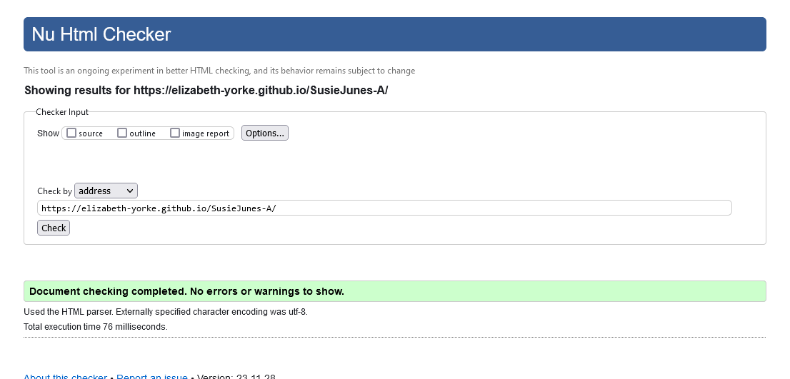 | No errors: Initial errors found and fixed.|
| Menu | [W3C](https://validator.w3.org/nu/?doc=https%3A%2F%2Felizabeth-yorke.github.io%2FSusieJunes-A%2Fmenu.html) | 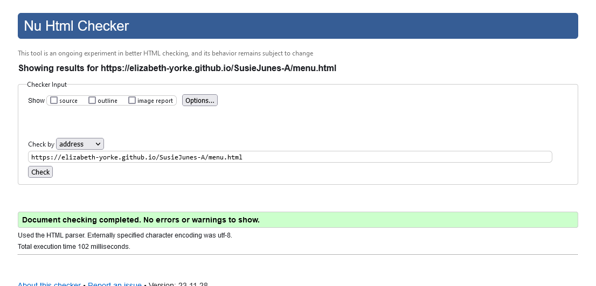 | No errors: Initial errors found and fixed.|
| Catering | [W3C](https://validator.w3.org/nu/?doc=https%3A%2F%2Felizabeth-yorke.github.io%2FSusieJunes-A%2Fcatering.html) | 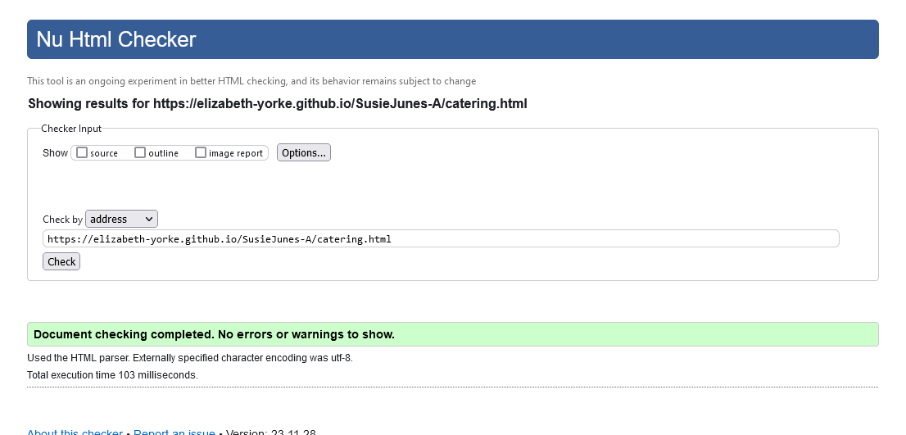 | No errors: Initial errors found and fixed.|
| Reservations | [W3C](https://elizabeth-yorke.github.io/SusieJunes-A/reservations.html) | 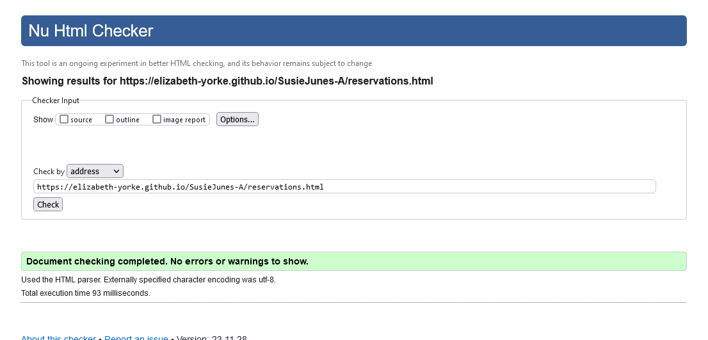 | No errors: Initial errors found and fixed.|
| Reservations 2 | [W3C](https://validator.w3.org/nu/?doc=https%3A%2F%2Felizabeth-yorke.github.io%2FSusieJunes-A%2Freservations-2.html%3Fcustomer-name%3De%26customer-phone%3D00000000000%26customer-email%3D) | 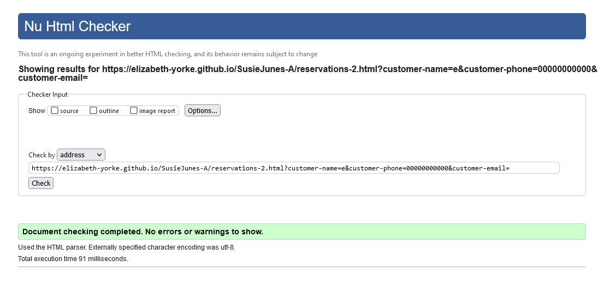 | No errors: Initial errors found and fixed.|
| Reservations 3 | [W3C](https://validator.w3.org/nu/?doc=https%3A%2F%2Felizabeth-yorke.github.io%2FSusieJunes-A%2Freservations-3.html%3Freservation-date%3D2023-12-21%26reservation-time%3D12%253A30%26number-of-people%3D3) | 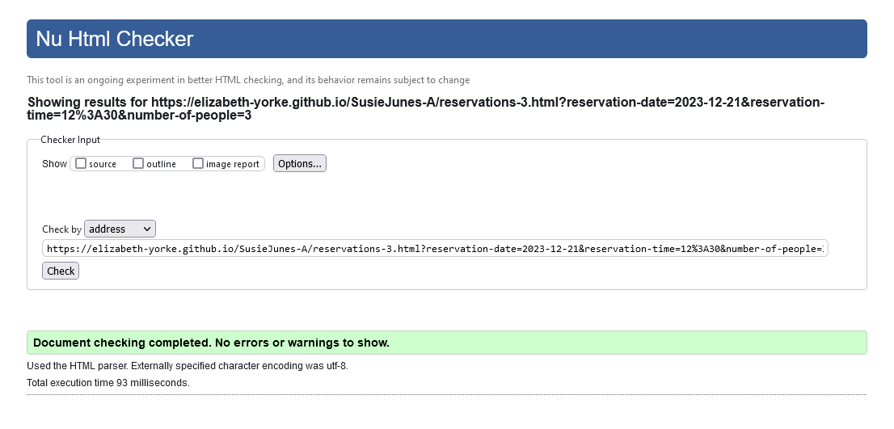 | No errors: Initial errors found and fixed.|
| Reservations 4 | [W3C](https://validator.w3.org/nu/?doc=https%3A%2F%2Felizabeth-yorke.github.io%2FSusieJunes-A%2Freservations-4.html%3Fadditional-info%3D) | 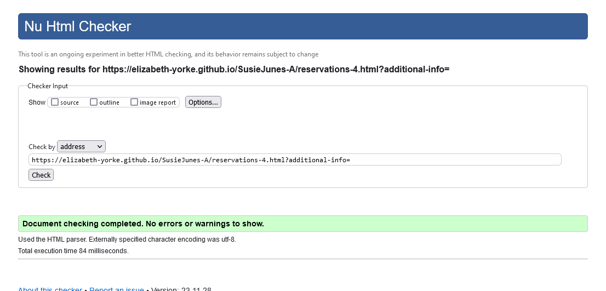 | No errors: Initial errors found and fixed.|

### CSS

The following validation has been done using the recommended [The W3C CSS Validaton Service](https://jigsaw.w3.org/css-validator/validator) using the live, deployed site using the site links shown below.

| Page | W3C URL | Screenshot | Notes |
| style.css| [W3C] (https://jigsaw.w3.org/css-validator/validator) | 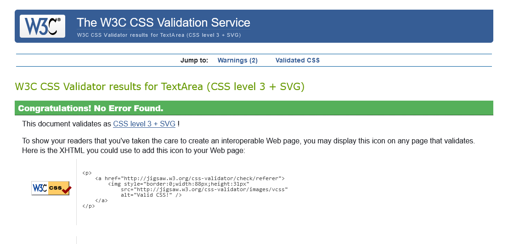 | No errors: Initial errors found and fixed.|

## Testing Browser Compatibility

I've tested my deployed project on multiple browsers to check for compatibility issues.

| Browser | Screenshot | Notes |
| --- | --- | --- |
| Chrome | 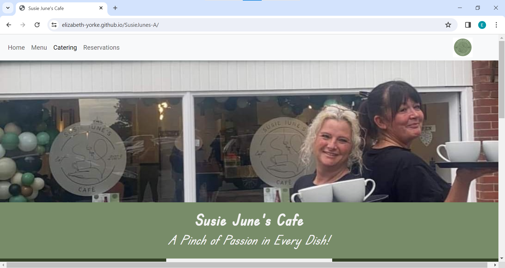 | Works as expected |
| Firefox | 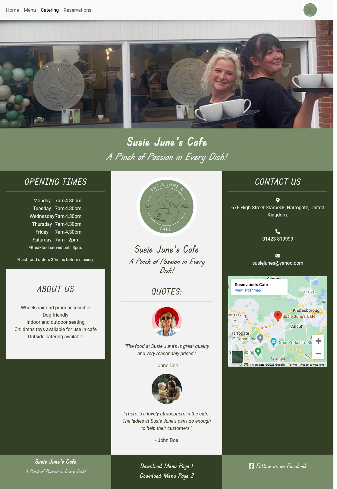 | Works as expected |
| Edge | 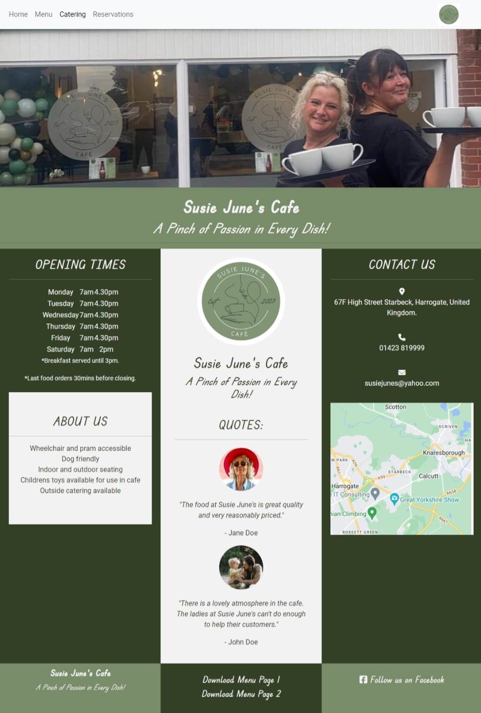 | Minor scaling issues |
| Brave | 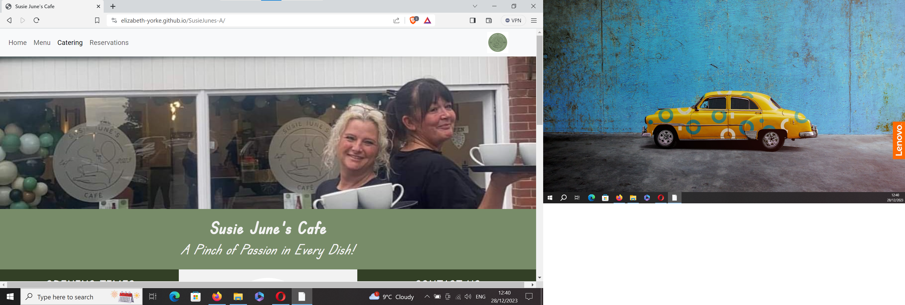 | Works as expected |
| Opera | 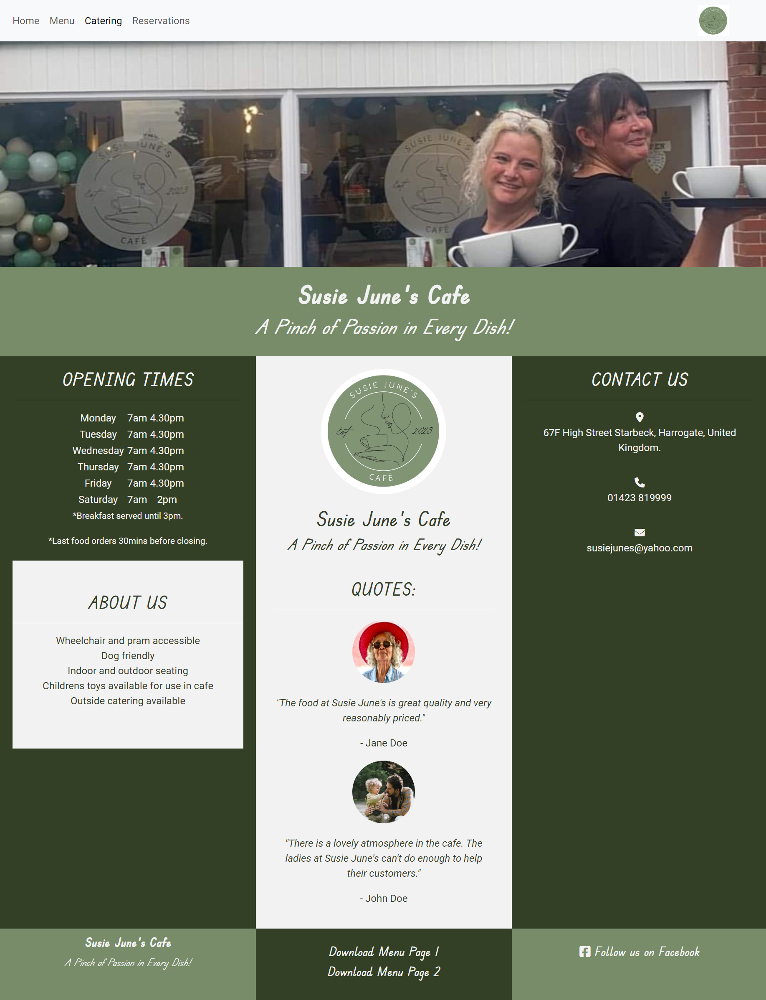 | Works as expected|
| Avast | 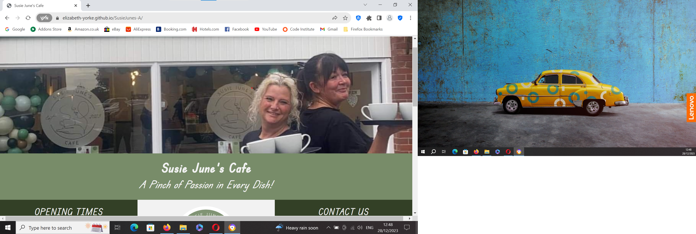 | Works as expected|

## Testing Responsiveness

I used media genesis responsive design checker [Media Genesis responsive design checker] (https://www.responsivedesignchecker.com/checker.php?url=https%3A%2F%2Felizabeth-yorke.github.io%2FSusieJunes-A%2F&width=1400&height=700) to check how responsive Susie June's website is. I used the live, deployed site. Links below.

|Device|Screensize|URL|Screenshot|Notes|
|Desktop 24"|Screensize 1920x1200|[screenshot](assets/documentation/media-genesis-screenshot-1920-1200.png) |Works as expected|
|Desktop 20"|Screensize 1600x900|[screenshot](assets/documentation/media-genesis-screenshot-1600x900.png) |Works as expected|
|Notebook 13"|Screensize 1024x800|[screenshot](assets/documentation/media-genesis-screenshot-1024x800.png) |Works as expected|
|Tablet Apple iPad Pro|Screensize 1366x1024|[screenshot](assets/documentation/media-genesis-screenshot-1366x1024.png) |Works as expected|
|Tablet Amazon Fire|Screensize 768x1024|[screenshot](assets/documentation/media-genesis-screenshot-768x1024.png) |Some image issues on the catering page only|
|Tablet Nexus 7|Screensize 600x960|[screenshot](assets/documentation/media-genesis-screenshot-600x960.png) |Works as expected|
|Phone Apple iPhone 7 Plus|Screensize 414x736|[screenshot](assets/documentation/media-genesis-screenshot-414x736.png) |Works as expected|
|Phone Google Pixel|Screensize 411x731|[screenshot](assets/documentation/media-genesis-screenshot-411x731.png) |Works as expected|
|Phone Sony Xperia Z3|Screensize 360x640|[screenshot](assets/documentation/media-genesis-screenshot-360x640.png) |Works as expected|

## Testing Website Speed

I tested my deployed project using using PageSpeed Insights via web.dev [PageSpeed](https://pagespeed.web.dev/analysis/https-elizabeth-yorke-github-io-SusieJunes-A/kv7di1miqk?form_factor=mobile)

|Page|Screensize|PageSpeed URL|Screenshot|Notes|
|Home|Mobile|[PageSpeed URL](https://pagespeed.web.dev/analysis/https-elizabeth-yorke-github-io-SusieJunes-A/kv7di1miqk?form_factor=mobile)|[screenshot](assets/documentation/pagespeed-screenshot-home-mobile.png)|The biggest performance problems are the bootstrap and fontawesome links. I can't improve the contrast of the writing on the company logo. Adding coloumn titles to the menu tables would be excessive visually. The audio menu can be used to aid accessibility in this situation.|
|Home|Desktop|[PageSpeed URL]()|[screenshot]()|Notes|
|Menu|Mobile|[PageSpeed URL]()|[screenshot]()|Notes|
|Menu|Desktop|[PageSpeed URL]()|[screenshot]()|Notes|
|Catering|Mobile[PageSpeed URL]()|[screenshot]()|Notes|
|Catering|Desktop|[PageSpeed URL]()|[screenshot]()|Notes|
|Reservations|Mobile|[PageSpeed URL]()|[screenshot]()|Notes|
|Reservations|Desktop|[PageSpeed URL]()|[screenshot]()|Notes|